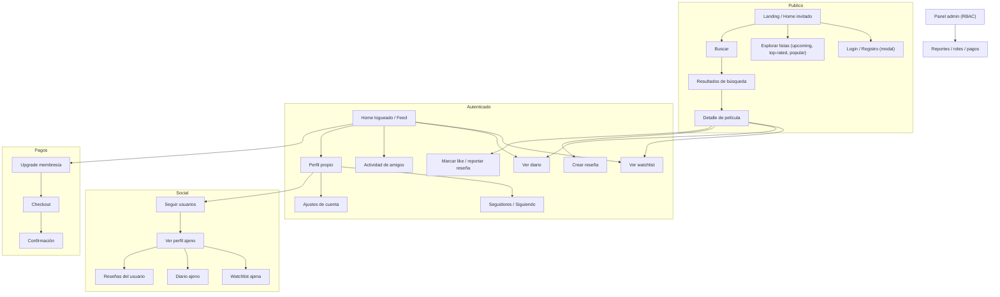
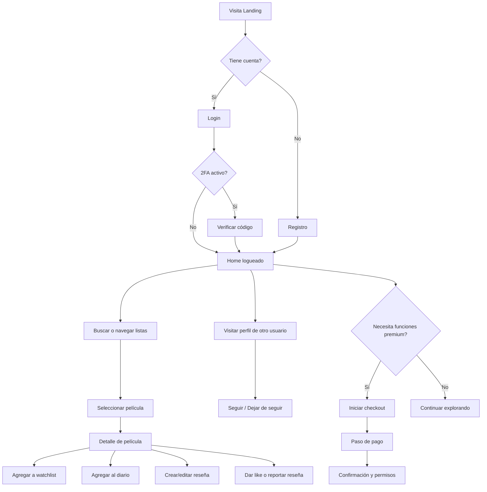

# CineVault · Mapa de Sitio y User Flows

## Contexto rápido
- Plataforma social cinéfila: descubrimiento, reseñas, diarios de visionado, watchlist y relaciones entre usuarios.
- API base en `/api`; documentación Swagger servida en `/api-docs` (solo autenticación cubierta actualmente).
- Frontend actual: páginas `Landing/Home`, `MovieDetail`, `SearchResults`; falta exponer UI para diario, watchlist, reseñas y ajustes.

## Mapa de sitio (alto nivel)

## User flow principal

## API actual (implementada) — prefijo `/api`

### Autenticación
| Método | Ruta | Descripción | Auth |
| --- | --- | --- | --- |
| POST | `/auth/register` | Registrar usuario | Pública |
| POST | `/auth/login` | Iniciar sesión (retorna token o challenge 2FA) | Pública |
| POST | `/auth/2fa/verificar` | Paso 2 de login | Pública (con token temporal) |
| POST | `/auth/resend-verification` | Reenviar email verificación | Pública |
| POST | `/auth/forgot-password` | Solicitar reset | Pública |
| POST | `/auth/reset-password` | Resetear contraseña | Pública |
| POST | `/auth/refresh` | Renovar access token vía cookie | Cookie |
| POST | `/auth/logout` | Cerrar sesión y revocar refresh | Bearer + cookie |
| GET  | `/auth/verify` | Validar token vigente | Bearer |
| POST | `/auth/verify-email/{token}` | Confirmar email | Pública |
| POST | `/auth/cambiar-contrasena` | Cambiar contraseña | Bearer |
| POST | `/auth/revocar-sesiones` | Revocar todas las sesiones | Bearer |
| POST | `/auth/2fa/activar` | Generar secreto/QR | Bearer |
| POST | `/auth/2fa/confirmar` | Confirmar 2FA | Bearer |
| POST | `/auth/2fa/desactivar` | Desactivar 2FA | Bearer |
| GET  | `/auth/google` | OAuth Google inicio | Pública |
| GET  | `/auth/google/callback` | Callback OAuth | Pública |

### Usuarios y social
| Método | Ruta | Descripción | Auth |
| --- | --- | --- | --- |
| GET | `/users/` | Listar usuarios (paginar/filtrar en backend) | Bearer |
| GET | `/users/{id}` | Perfil público (bio, avatar, stats) | Pública |
| POST | `/users/follow/{id}` | Seguir usuario | Bearer |
| DELETE | `/users/unfollow/{id}` | Dejar de seguir | Bearer |
| GET | `/users/{id}/followers` | Listar seguidores | Pública |
| GET | `/users/{id}/following` | Listar seguidos | Pública |

### Películas y contenido TMDB
| Método | Ruta | Descripción | Auth |
| --- | --- | --- | --- |
| GET | `/movies/upcoming` | Estrenos próximos | Pública |
| GET | `/movies/top-rated` | Más valoradas | Pública |
| GET | `/movies/popular` | Populares | Pública |
| GET | `/movies/{idOrSlug}` | Detalle completo (credits, providers, alt titles, imágenes) | Pública |

### Búsqueda
| Método | Ruta | Descripción | Auth |
| --- | --- | --- | --- |
| GET | `/search/` | Búsqueda general | Pública |
| GET | `/search/multi` | Multi (personas, series, películas) | Pública |
| GET | `/search/movie` | Solo películas | Pública |
| GET | `/search/person` | Solo personas | Pública |
| GET | `/search/tv` | Solo series | Pública |

### Diario de visionado
| Método | Ruta | Descripción | Auth |
| --- | --- | --- | --- |
| GET | `/diary/` | Diario propio | Bearer |
| GET | `/diary/{id_user}` | Diario público de otro usuario | Pública |
| POST | `/diary/` | Crear entrada | Bearer |
| DELETE | `/diary/{id}` | Eliminar entrada | Bearer |

### Watchlist
| Método | Ruta | Descripción | Auth |
| --- | --- | --- | --- |
| GET | `/watchlist/` | Watchlist propia | Bearer |
| GET | `/watchlist/{id_user}` | Watchlist pública de otro usuario | Pública |
| POST | `/watchlist/` | Añadir película | Bearer |
| DELETE | `/watchlist/{movie_id}` | Quitar película | Bearer |

### Reseñas
| Método | Ruta | Descripción | Auth |
| --- | --- | --- | --- |
| GET | `/reviews/` | Mis reseñas | Bearer |
| GET | `/reviews/user/{userId}` | Reseñas de un usuario | Pública |
| GET | `/reviews/movie/{movieId}` | Reseñas de una película | Pública |
| POST | `/reviews/` | Crear reseña | Bearer |
| PATCH | `/reviews/{reviewId}` | Editar reseña | Bearer |
| DELETE | `/reviews/{reviewId}` | Eliminar reseña | Bearer |
| POST | `/reviews/{reviewId}/like` | Dar like | Bearer |
| DELETE | `/reviews/{reviewId}/like` | Quitar like | Bearer |
| POST | `/reviews/{reviewId}/report` | Reportar | Bearer |

### Información de personas (TMDB)
| Método | Ruta | Descripción | Auth |
| --- | --- | --- | --- |
| GET | `/information/person/{id}` | Datos de persona | Pública |
| GET | `/information/person/{id}/combined_credits` | Créditos combinados | Pública |

### Pagos
| Método | Ruta | Descripción | Auth |
| --- | --- | --- | --- |
| GET | `/payments/create-checkout-session` | Crear sesión de pago (Stripe) | Bearer |

### RBAC (ejemplos de referencia)
Rutas de ejemplo para probar middlewares de permisos y ownership:
- DELETE `/rbac/reviews/{id}` — propietario o permiso `BORRAR_REVIEWS_AJENAS`.
- POST/PATCH/DELETE `/rbac/news` — requiere `GESTIONAR_NOTICIAS`.
- GET `/rbac/reports` y PATCH `/rbac/reports/{id}` — ver/gestionar reportes.
- PATCH `/rbac/users/{id}/role`, GET `/rbac/users/activity`, GET `/rbac/payments` — administración.

## Documentación y lógica pendiente
- Swagger: solo cubre autenticación. Falta documentar users, movies, search, diary, watchlist, reviews, payments, information y ejemplos RBAC.
- Ajustes de cuenta: rutas en `src/routes/settings.routes.ts` no están montadas en `server.ts`; decidir si se exponen o se reemplazan por `/users`.
- Favoritos, memberships y comentarios de reseñas aparecen planeados en código; definir modelo y rutas si se requieren.
- Añadir validación/DTOs en rutas sin esquema público (diary, watchlist, reviews) y reflejarlo en OpenAPI.
- Notificaciones y actividad social (seguimientos, likes) no tienen endpoints dedicados; considerar un feed y contadores.
- Moderación: completar flujo de reportes (apertura de reporte hoy solo en `/reviews/{id}/report` y ejemplos RBAC).
- Webhooks de pago/renovación si la membresía será recurrente.

## Próximos pasos sugeridos
1) Publicar y enlazar `/api-docs` actualizada con todas las rutas anteriores.
2) Conectar UI a diario, watchlist y reseñas (forms + estados) en frontend.
3) Exponer ajustes de cuenta (perfil, avatar, seguridad) o remover rutas muertas.
4) Implementar comentarios en reseñas y notificaciones; añadir permisos RBAC correspondientes.
5) Añadir tests e2e básicos para login, flujo de reseña y compra.
